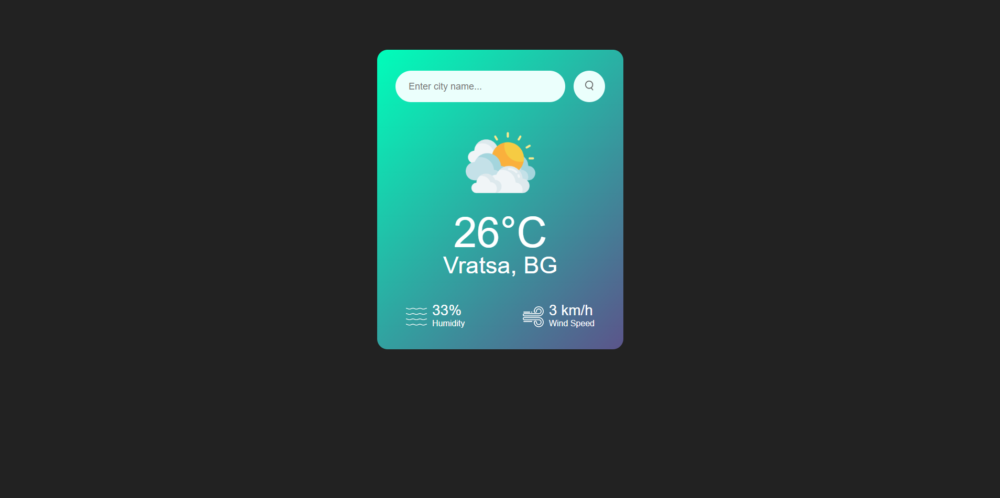
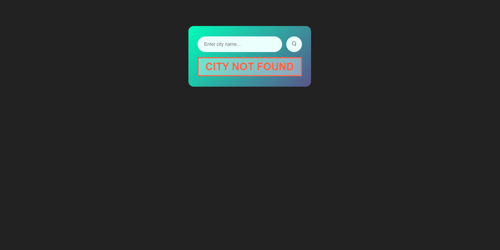

# Weather-App
Weather made simple! A user-friendly app to check weather conditions, wherever you are. 🌍🌤️📱

Welcome to our Weather App for Website! With the power of HTML, CSS, and JavaScript, you can now easily access real-time weather data. Utilizing the Fess API from OpenWeatherMap, our app fetches current weather information, including temperature, weather condition, humidity, and wind speed, based on the city you specify.

Using JavaScript, we seamlessly integrate this weather data into our website, offering a user-friendly experience. Our app features a convenient search box, enabling users to enter the name of any city and instantly retrieve its weather information.

Stay informed and prepared with our Weather App for Website – an essential tool to keep you updated on weather conditions worldwide!

